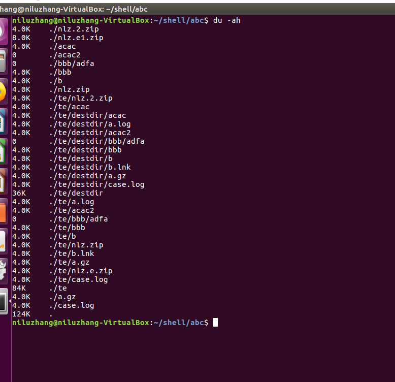
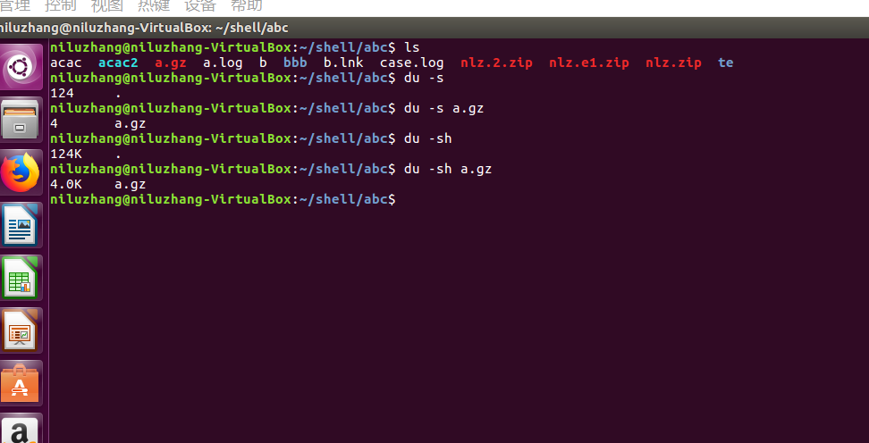

# 磁盘管理
+ df命令  
df命令用于显示磁盘分区上的可使用的磁盘空间。默认显示单位为KB。可以利用该命令来获取硬盘被占用了多少空间，目前还剩下多少空间等信息。  
命令格式:
    ````
    df [-ahikHTm] [目录或文件名]...
    ````
    选项说明:
    ````
    -a ：列出所有的文件系统，包括系统特有的 /proc 等文件系统；
    -k ：以 KBytes 的容量显示各文件系统；
    -m ：以 MBytes 的容量显示各文件系统；
    -h ：以人们较易阅读的 GBytes, MBytes, KBytes 等格式自行显示；
    -H ：以 M=1000K 取代 M=1024K 的进位方式；
    -T ：显示文件系统类型, 连同该 partition 的 filesystem 名称 (例如 ext3) 也列出；
    -i ：不用硬盘容量，而以 inode 的数量来显示
    ````
    运行实例:
    
    
+ du命令
du命令也是查看使用空间的，但是与df命令不同的是Linux du命令是对文件和目录磁盘使用的空间的查看，还是和df命令有一些区别的。
命令格式:
    ````
    du [-ahskm] [文件或目录名称]...
    ````
    选项说明:
    ````
    -a ：列出所有的文件与目录容量，因为默认仅统计目录底下的文件量而已。
    -h ：以人们较易读的容量格式 (G/M) 显示；
    -s ：列出总量而已，而不列出每个各别的目录占用容量；
    -S ：不包括子目录下的总计，与 -s 有点差别。
    -k ：以 KBytes 列出容量显示；
    -m ：以 MBytes 列出容量显示；
    ````
    运行实例:
    
    
    
    我们可以看到，du只列出当前目录下的所有文件夹容量(包括隐藏文件夹)，而`du -a`将文件的容量也列出来。
+ fdisk、fsck、mkfs、mount、umount  
[其他磁盘管理命令。](https://www.runoob.com/linux/linux-filesystem.html "其他磁盘管理命令")