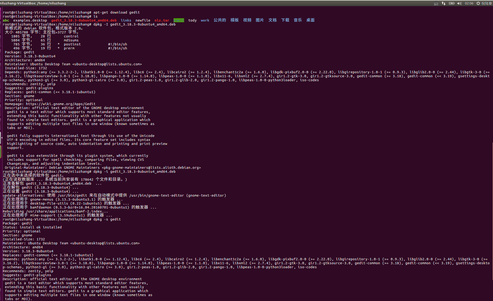
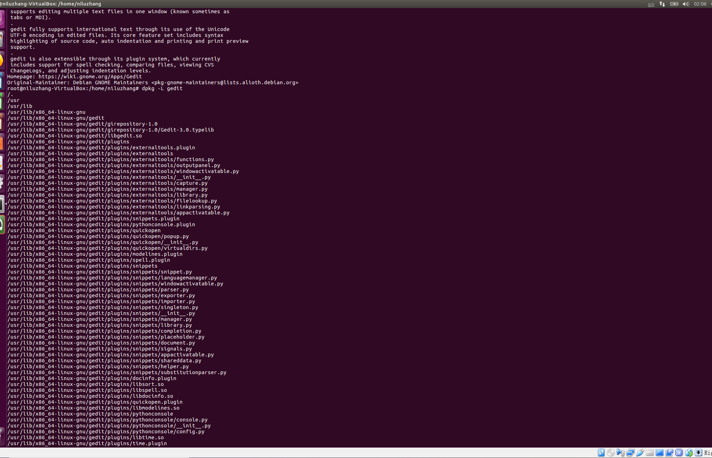
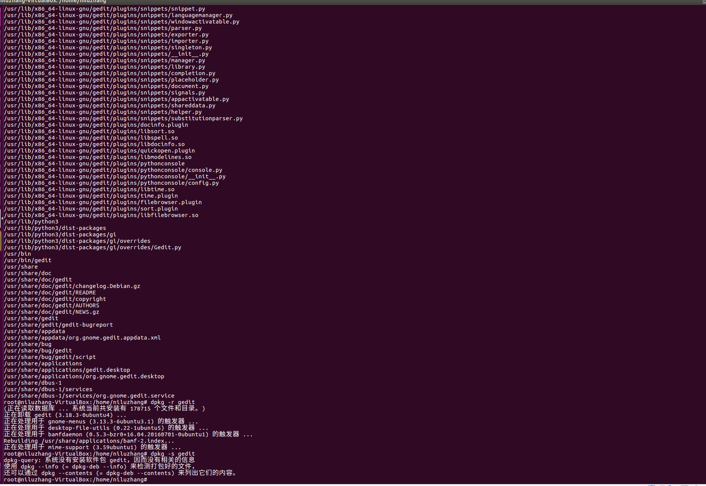

# Linux下的软件安装
Linux下安装软件有多种方式:
+ 使用包管理器安装(如dpkg、apt、rpm、yum等)；
+ 从源码安装；
+ 从.bin文件安装。

下面分别介绍。
## 包管理器安装
在Linux中，包管理器非常重要，了解如何使用多种包管理器可以让你像一个高手一样活得很舒适，从在仓库下载软件、安装软件，到更新软件、处理依赖和删除软件是非常重要的，这也是Linux系统管理的一个重要部分。  
dpkg(Debian Package)是Debian Linux家族的基础包管理系统，它用于安装、删除、存储和提供deb包的信息。这是一个低层面的工具，并且有多个前端工具可以帮助用户从远程的仓库获取包，或处理复杂的包关系的工具，比如apt(Advanced Packaging Tool)等。  
rpm(Red-Hat Package Manager)包管理器是红帽创建的Linux基本标准(LSB)打包格式和基础包管理系统。基于这个底层系统，有多个前端包管理工具可供你使用，但我们应该只看那些最好的，比如yum(Yellow dog Updater, Modified)等。
### dpkg命令
dpkg用于从本地磁盘安装deb包。因此需要先手动下载deb文件。  
dpkg命令常用选项: -i <deb>，安装指定deb包；-R <目录名>，安装该目录下的所有deb包；-I <deb>，显示deb包文件的信息；-r <软件包自身的名字>，卸载该软件包；-s <软件包自身的名字>，显示已安装软件的信息；-S <模式>，从安装的软件包中查询文件；-L <软件包自身的名字>，显示已安装软件包的文件的目录信息。  
接下来我们使用上述命令进行deb的安装、卸载以及信息查看等操作:
````
我们用gedit进行演示，gedit是Linux下的一款文本编辑器工具。
首先要下载gedit的deb包，我们通过apt-get download命令下载
apt-get download gedit

下载完后，可以看到当前目录下出现gedit_3.18.3-0ubuntu4_amd64.deb
我们可以通过-I <deb>查看该deb包的信息
dpkg -I gedit_3.18.3-0ubuntu4_amd64.deb

然后我们通过dpkg -i来安装这个deb包
dpkg -i gedit_3.18.3-0ubuntu4_amd64.deb

安装完成后我们可以查看该gedit软件的信息
dpkg -s gedit

通过-L <软件包名字>查看软件的各个文件的位置
dpkg -L gedit

通过-r <软件包名字>卸载该软件
dpkg -r gedit

再次通过-s查询gedit软件状态，控制台将提示软件未安装。
````
上述操作具体实践截图如下:
  
  
  